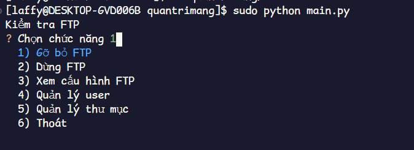
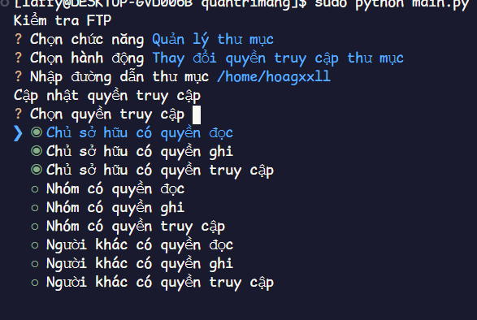
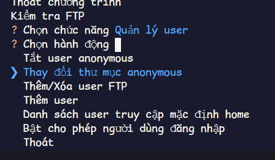
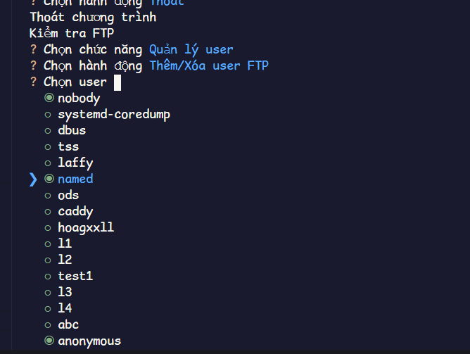
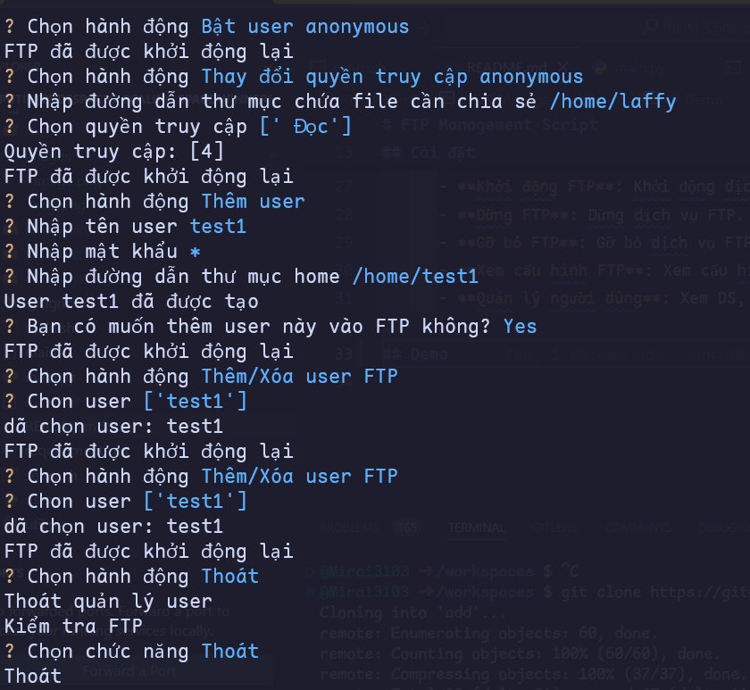
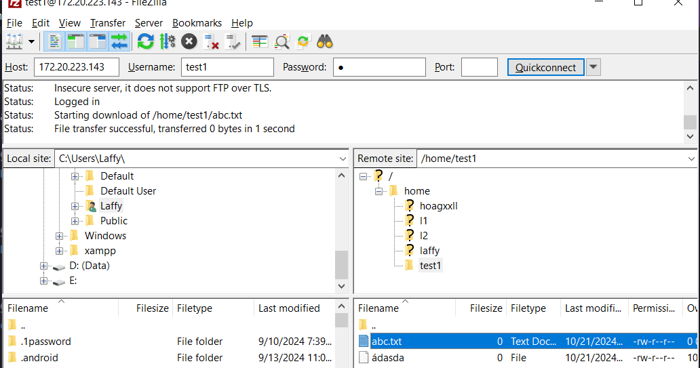

# FTP Management Script

Đây là một script Python dùng để quản lý dịch vụ FTP (`vsftpd`) trên hệ điều hành CentOS. Script này cho phép bạn cài đặt, khởi động, dừng, gỡ bỏ, xem cấu hình FTP và quản lý người dùng.

## Yêu cầu

- Python 3.x
- RedHatEnterpriseLinux base distro (eg: Centos, Fedora, Rocky...)
- Phải có kết nối mạng bên ngoài
- Đã fix lỗi gói yum
## Cài đặt

1. **Cài đặt**:
   ```bash
   curl -s https://raw.githubusercontent.com/Mirai3103/ftputil/refs/heads/master/setup.sh | bash
   ```
2. **Chạy**:

  ```bash
   ftputil
   ```
4. **Chức năng**
   
      - **Cài đặt FTP**: Cài đặt FTP server `vsftpd` trên CentOS.
      - **Khởi động FTP**: Khởi động dịch vụ FTP.
      - **Dừng FTP**: Dừng dịch vụ FTP.
      - **Gỡ bỏ FTP**: Gỡ bỏ dịch vụ FTP.
      - **Quản lý người dùng**: Xem DS, Thêm, xóa, sửa người dùng FTP. Cấu hình người dùng anonymous, Cấu hình thư mục
      - **Quản lý thư mục** Tạo, Xoá, Phân quyền thư mục
   
## Demo
- Menu chính






- Cài đặt FTP, Thêm người dùng

- Kết quả

